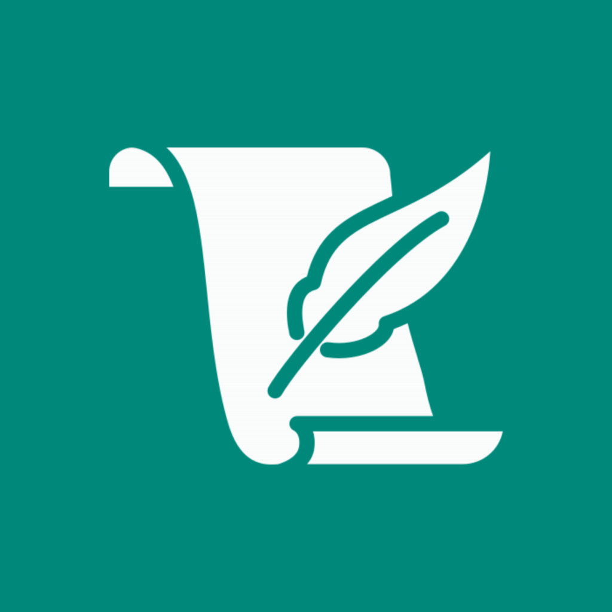

<div align="center">
  
  <h1>Nodly</h1>
  <p><b>A Daily Quick Things-to-Do App</b></p>

  <a href="https://github.com/fareeo/Nodly/raw/main/releases/app-release.apk">
    
  </a>
  <br/>
  <p>
    <a href="https://github.com/fareeo/Nodly/raw/main/releases/app-release.apk">📥 Alternative Direct APK Download Link</a>
  </p>
</div>

---

## 🌟 Overview

**Nodly** is an elegant, lightning-fast daily task and quick-note application designed to keep your focus sharp and your day organized. Built with **Flutter**, Nodly combines state-of-the-art aesthetics with intuitive micro-animations, customizable typography, smart notifications, and native home screen integration.


---

## ✨ Key Features & Use Cases

### 📅 Daily Date Selector & Task Management
- **Seamless Week Navigation**: Effortlessly glide through past, current, and future dates with smooth opacity transitions and instant loading.
- **Intuitive Swipe Gestures**:
  - **Swipe Right**: Quickly mark items done with satisfying visual feedback and a floating `Undo` option.
  - **Swipe Left**: Delete tasks or move notes to `Tomorrow` or `Yesterday` with a single swipe.
- **Floating Action Button & Quick Edit**: Add or edit daily notes in a flash using the auto-focused dialog.

### 🎨 8 Curated Themes & Custom Appearance
- **8 Dynamic Themes**: Choose between **Legacy (Teal)**, **Material You (Dynamic Wallpaper Colors)**, **Ocean Depths**, **Sunset Glow**, **Nordic Frost**, **Rose Garden**, **Midnight Amethyst**, and **Forest Canopy**. Each theme features tailored Light and Dark mode variations.
- **Visual Theme Selector**: The settings card displays the exact theme seed color in an inner circle with real-time card surface previews.
- **Accent Color Control**: Lock into your system's `Material You` colors or select from 6 vibrant preset accents (`Teal`, `Indigo`, `Coral`, `Amber`, `Emerald`, `Sky`).
- **Typography & Scale**: Toggle between modern font families (`Roboto Condensed`, `Inter`, `Poppins`, `System Default`) and adjust global font sizes (`80%` to `140%`).

### ⚡ Resizable Android Home Screen Widget
- **Quick Add from Home**: Add tasks directly from your Android home screen without launching into menus.
- **Fully Resizable (`1x1` to `2x2+`)**: Dynamically scales and centers the high-contrast white plus icon inside the rounded Legacy Teal (`#00897B`) background, looking crisp across horizontal pills (`1x2`), vertical bars (`2x1`), or large tiles (`2x2`).
- **Instant Keyboard Focus**: Tapping the widget instantly brings up the Nodly dialog focused on today's date so you can jot down thoughts in seconds.

### 🔔 Smart Daily Reminders
- **Flexible Notification Intervals**: Choose from preset intervals (`1 hour`, `3 hours`, `5 hours`) or set a custom minute/hour reminder period.
- **First Task Attachment**: Notifications intelligently attach to and remind you of the first pending note of the day.

---

## 📱 Device Compatibility

| Platform | Minimum Version | Recommended / Target | Notes |
| :--- | :--- | :--- | :--- |
| **Android** | Android 8.0 (API 26) | Android 14 / 15 (API 34/35) | Full support for dynamic `Material You` wallpaper theming (`Android 12+`) and resizable home screen widgets (`AppWidgetProvider`). |
| **iOS / Cross-Platform** | iOS 14.0+ | iOS 17.0+ | Built on standard Flutter 3.11+ / Dart 3.11+ codebases (`uses-material-design: true`). |

---

## 🚀 Getting Started & Local Development

### 1. Prerequisites
Ensure you have the following installed:
- [Flutter SDK](https://docs.flutter.dev/get-started/install) (`^3.11.0` or higher)
- [Android Studio](https://developer.android.com/studio) or command line build tools
- An emulator or physical device connected via ADB

### 2. Clone & Setup
```bash
git clone https://github.com/fareeo/Nodly.git
cd Nodly
flutter pub get
```

### 3. Run Locally
To run Nodly in debug mode on your connected device or emulator:
```bash
flutter run
```

### 4. Build Final Production Release (Android)
To compile the standalone production APK:
```bash
flutter build apk --release
```
The generated APK will be available at:
`build/app/outputs/flutter-apk/app-release.apk`

---

## 📲 Installation on iPhone (iOS)

To run **Nodly** on your physical iPhone, follow these instructions:

> [!NOTE]
> The `ios/` project folder is now included right in the repository! If you ever need to regenerate or refresh iOS platform files on your Mac, simply run `flutter create --platforms=ios .` in the project root.

### Method 1: Build & Run via Mac & Xcode (Free)
1. **Connect your iPhone**: Plug your iPhone into your Mac via USB/Lightning cable and tap **Trust This Computer** on your phone screen.
2. **Prepare & Open Xcode**:
   ```bash
   # Ensure dependencies and iOS folder are ready
   flutter pub get
   
   # Open the iOS workspace in Xcode
   cd ios
   open Runner.xcworkspace
   ```
3. **Select your Apple ID**: In Xcode, click the top **Runner** project in the left sidebar > click the **Signing & Capabilities** tab > select your personal Apple ID under **Team** (Xcode automatically generates a free developer provisioning profile).
4. **Build & Install to iPhone**: Select your connected physical iPhone from Xcode's top device target dropdown and press `Cmd + R` (**Play / Run** button), **OR** run from your terminal:
   ```bash
   cd ..
   flutter run -d <your-iphone-device-id>
   ```
5. **Trust the Certificate on iPhone**: Once installed, unlock your iPhone, go to **Settings** > **General** > **VPN & Device Management**, tap your Apple ID certificate, and select **Trust**. Launch Nodly!

---

### Method 2: Sideloading `.ipa` via Sideloadly / AltStore (Windows or Mac)
If you want to install via sideloading tools like **Sideloadly** or **AltStore**:
1. **Build the `.ipa` package** (on a Mac with Flutter/Xcode):
   ```bash
   flutter build ipa --no-codesign
   ```
   *(Or export a signed `.ipa` directly from Xcode via **Product > Archive**).*
2. **Install via Sideloadly / AltStore**:
   - Download and open [Sideloadly](https://sideloadly.io/) or [AltStore](https://altstore.io/) on your Windows PC or Mac.
   - Connect your iPhone via USB.
   - Drag and drop the compiled `.ipa` file into Sideloadly/AltStore, enter your Apple ID, and click **Start**.
3. **Trust on iPhone**: Go to **Settings** > **General** > **VPN & Device Management** on your iPhone and tap **Trust** on your Apple ID certificate to launch Nodly.

---

## 📄 License

This project is licensed under the **Personal & Non-Commercial License (CC BY-NC 4.0 Equivalent)**.  
You are free to view, fork, modify, and use this code for personal, educational, or non-commercial purposes. **Commercial use, redistribution for profit, or selling of this software/codebase is strictly prohibited** without explicit written permission from the author (**fareeo**).  
See the [LICENSE](LICENSE) file for full details.

---

<div align="center">
  <p>Made by <b>fareeo</b></p>
</div>
