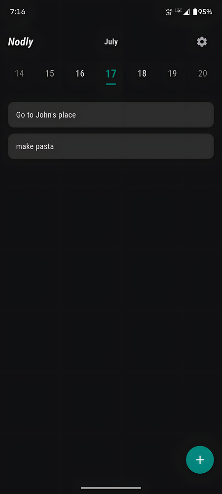
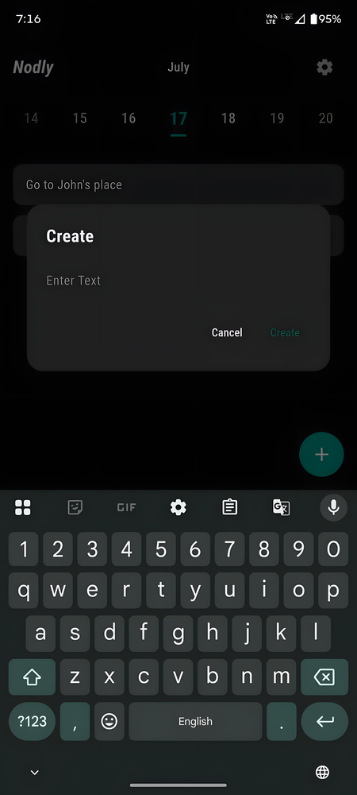
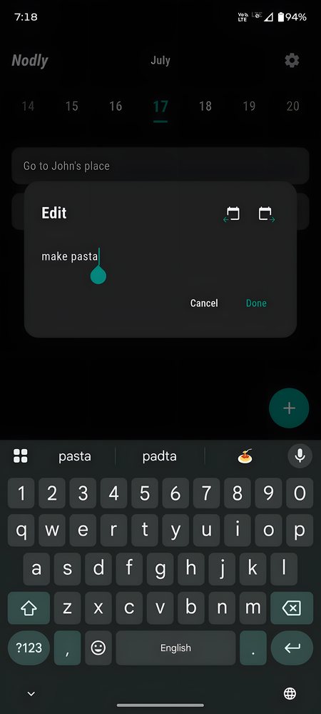
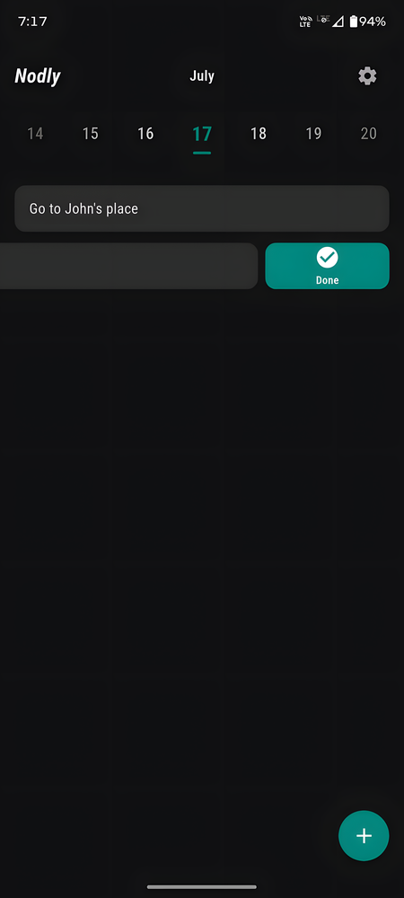
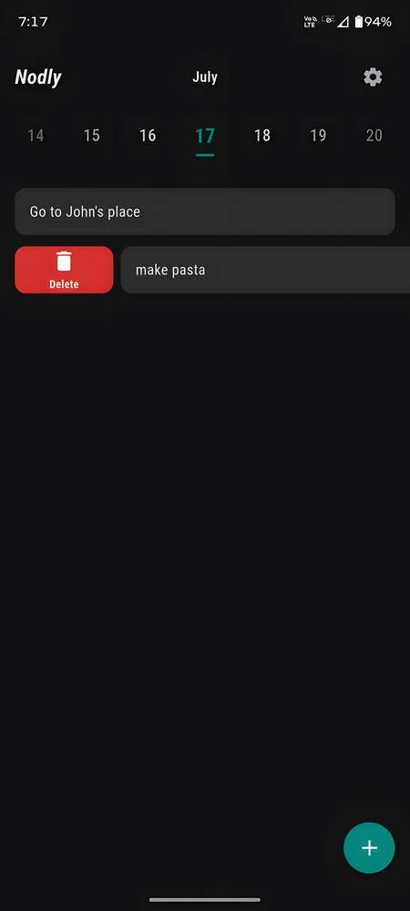

<div align="center">
  
  <h1>Nodly</h1>
  <p><b>A Daily Quick Things-to-Do App</b></p>
  <p>
    
    
    
    
  </p>

  <a href="https://github.com/fareeo/Nodly/raw/main/releases/app-release.apk">
    
  </a>
</div>

---

## 🌟 Overview

**Nodly** is a minimal yet powerful daily task and quick-note app built with **Flutter**. It's designed around one simple idea: *each day gets its own clean slate*. Swipe through dates, jot down what needs doing, and move on. No folders, no tags, no clutter — just your daily list.

### 📸 Screenshots

    


---

## ✨ Features

### 📅 Daily Task Management
- **Date-based organization** — Each day has its own task list with smooth week navigation.
- **Swipe gestures** — Swipe right to mark done (with undo), swipe left to delete or move to tomorrow/yesterday.
- **Quick edit** — Tap any item to edit inline with auto-focused keyboard.

### 🎨 8 Themes & Full Customization
- **8 curated themes** — Legacy (Teal), Material You, Ocean Depths, Sunset Glow, Nordic Frost, Rose Garden, Midnight Amethyst, and Forest Canopy. Each supports light & dark mode.
- **Material You integration** — Dynamically pulls accent colors from your Android 12+ wallpaper.
- **Accent color picker** — 10 preset accents or use your system's dynamic color.
- **Typography controls** — Choose from Roboto Condensed, Inter, Poppins, or System Default. Adjust font size from 80% to 140% via slider.

### ⚡ Home Screen Widget
- **Quick Add widget** — Resizable from `1×1` to `2×2+`. Tap to instantly open the add dialog for today.
- **Native Android widget** — Uses `AppWidgetProvider` with a teal-on-white plus icon that scales cleanly at any size.

### 🔔 Smart Reminders
- **Scheduled notifications** — Set reminders at 1h, 3h, 5h intervals or define a custom period.
- **Context-aware** — Notifications display your first pending task of the day.
- **Reliable delivery** — Uses `zonedSchedule` with Doze-mode support and automatic re-scheduling on app resume.

---

## 📱 Compatibility

| Platform | Minimum | Recommended | Notes |
| :--- | :--- | :--- | :--- |
| **Android** | 8.0 (API 26) | 14+ (API 34+) | Material You theming on Android 12+, home screen widget support |
| **iOS** | 14.0+ | 17.0+ | Full Flutter support; widget not available on iOS |

---

## 🚀 Getting Started

### Prerequisites
- [Flutter SDK](https://docs.flutter.dev/get-started/install) `3.11.0` or higher
- Android Studio / Xcode (for device builds)
- A physical device or emulator

### Clone & Run
```bash
git clone https://github.com/fareeo/Nodly.git
cd Nodly
flutter pub get
flutter run
```

### Build Release APK (Android)
```bash
flutter build apk --release
# Output: build/app/outputs/flutter-apk/app-release.apk
```

---

## 📲 Running on iPhone (iOS)

### Option 1: Build with Xcode (Free)
1. Connect your iPhone via USB and tap **Trust This Computer**.
2. Run:
   ```bash
   flutter pub get
   cd ios && open Runner.xcworkspace
   ```
3. In Xcode: **Runner** project → **Signing & Capabilities** → select your Apple ID under **Team**.
4. Select your iPhone from the device dropdown → press `Cmd + R` to build & install.
5. On iPhone: **Settings** → **General** → **VPN & Device Management** → tap your certificate → **Trust**.

### Option 2: Sideload via Sideloadly / AltStore
1. Build the `.ipa`:
   ```bash
   flutter build ipa --no-codesign
   ```
2. Open [Sideloadly](https://sideloadly.io/) or [AltStore](https://altstore.io/), connect your iPhone via USB, drag in the `.ipa`, enter your Apple ID, and click **Start**.
3. On iPhone: **Settings** → **General** → **VPN & Device Management** → **Trust** your certificate.

---

## 🏗️ Project Structure

```
lib/
├── main.dart                  # App entry point & theme builder
├── models/
│   ├── nodly_item.dart        # Task/note data model
│   └── nodly_dialog_result.dart
├── screens/
│   ├── home_screen.dart       # Main task list with swipe gestures
│   └── settings_screen.dart   # Theme, font, notification settings
├── services/
│   ├── storage_service.dart   # SharedPreferences-based persistence
│   ├── settings_service.dart  # Centralized settings with ChangeNotifier
│   └── notification_service.dart  # zonedSchedule-based reminders
├── theme/
│   └── app_theme.dart         # 8-theme color system & ThemeData builder
└── widgets/
    ├── date_selector.dart     # Horizontal week date picker
    ├── nodly_card.dart        # Swipeable task card
    └── nodly_dialog.dart      # Add/edit dialog
```

---

## 📄 License

This project is licensed under the **Personal & Non-Commercial License**.  
You are free to view, fork, modify, and use this code for personal or educational purposes. **Commercial use, redistribution for profit, or selling is strictly prohibited** without written permission from the author.  
See the [LICENSE](LICENSE) file for full details.

---

<div align="center">
  <p>Made by <b>fareeo</b></p>
</div>
